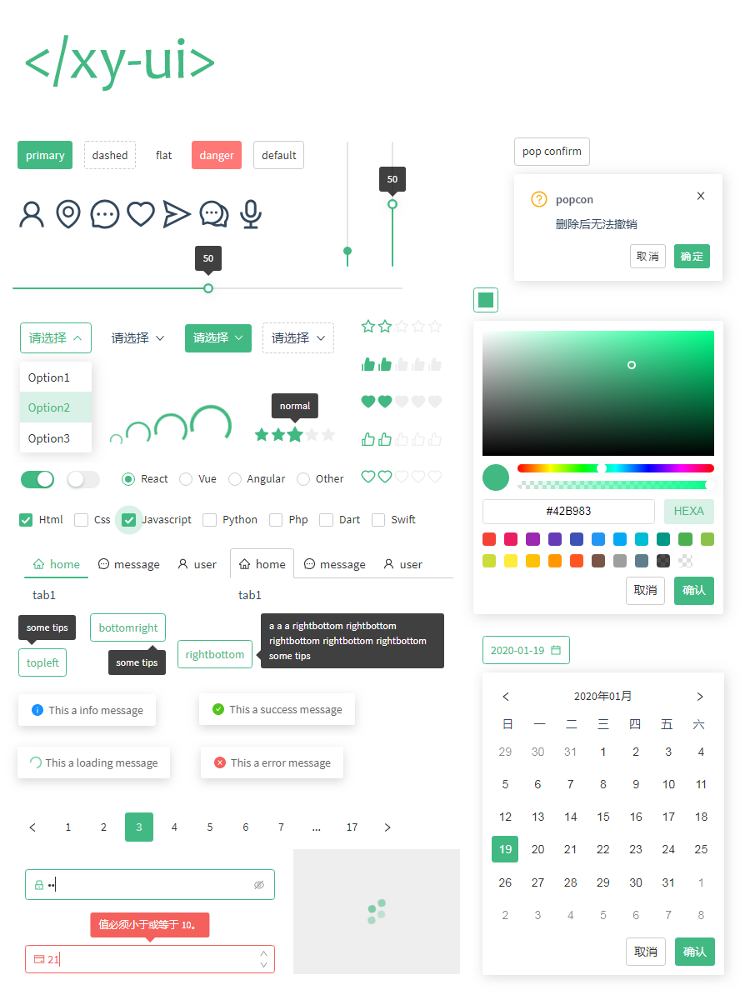

# xy-ui

[](https://www.npmjs.com/package/xy-ui)


[](https://github.com/XboxYan/xy-ui/stargazers)
[](https://github.com/XboxYan/xy-ui/network/members)

`xy-ui`是一套使用原生`Web Components`规范开发的跨框架UI组件库。[查看文档](https://xy-ui.codelabo.cn/docs)

[github项目地址](https://github.com/XboxYan/xy-ui)



## 更新
* ## 1.9.5
    * 修复`xy-popover`关于`title`属性失效的问题
    * 重新整理`xy-tips`关于`dir`方向的展示，更直观
    * 优化`确定`、`取消`按钮的大小，并增加了空格，更和谐
* ## 1.9.4
    * 移除`Edge`密码输入框的默认切换按钮
* ## 1.9.3
    * 新增[`xy-input-group`](./docs/xy-input.md?id=组合xy-input-group)组件
    * `xy-icon`新增`spin`属性
    * 修复`input[type=number]`的`onchange`回调
    * 修复`xy-color-picker`色相选择回调
* ## 1.9.2
    * `xy-view`新增`coord`坐标
    * 所有表单元素只有在实际触发（比如点击、键盘`Enter`）时才会触发`change`回调，通过直接修改`value`不会触发（与原生保持一致）
* ## 1.9.1
    * [`xy-view`](./docs/xy-view.md)新增`draggable`、`allowdrop`、`resizable`等特性
    * 新增[`xy-button-group`](./docs/xy-button-group.md?id=按钮组xy-button-group)组件
* ## 1.9.0
    * `xy-form-item`布局采用`grid`实现，去除`legendwidth`属性
    * `xy-text`新增`draggable`属性
    * 表单元素的`reset`方法现定义为"重置"，即还原成默认值
    * `xy-select`新增分组`xy-optgroup`
    * 新增`xy-view`组件（实验性），扩展常见功能，如`drag`等（进行中）

[update](./docs/update.md)

## 特性

* 跨框架。无论是`react`、`vue`还是原生项目均可使用。
* 组件化。`shadow dom`真正意义上实现了样式和功能的组件化。
* 类原生。一个组件就像使用一个`div`标签一样。
* 无依赖。纯原生，无需任何预处理器编译。
* 无障碍。支持键盘访问。

## 兼容性

现代浏览器。

包括移动端，不支持`IE`。

> `IE`不支持原生`customElements`，[webcomponentsjs](https://github.com/webcomponents/webcomponentsjs)可以实现对`IE`的兼容，不过很多`CSS`特性仍然无效，所以放弃

## 安装

* npm

```shell
npm i xy-ui
```

* cdn

```html
<script type="module">
    import 'https://unpkg.com/xy-ui';

    import 'https://unpkg.com/xy-ui@1.4.1';//指定版本号
</script>

<!--or-->

<script type="module" src="https://unpkg.com/xy-ui"></script>
```

* 直接在`github`上获取最新文件（推荐）。

目录如下：

```text
.
└── xy-ui
    ├── components //功能组件
    |   ├── xy-icon.js
    |   └── ...
    └── iconfont //图标库
        └── icon.svg
```
     

将整个文件夹放入项目当中。

### html引用

```html
<script type="module">
    import './node_modules/xy-ui/index.js'; //推荐
    //如需单独使用，文档中都是单独使用的情况，推荐全部引用，即第一种方式。
    import './node_modules/xy-ui/components/xy-button.js';
</script>
<xy-button>button</xy-button>
```

> 现代浏览器支持原生`import`语法，不过需要注意`script`的类型`type="module"`。

### react项目引用

```js
import 'xy-ui';//推荐
//如需单独使用
import 'xy-ui/components/xy-button.js';
ReactDOM.render(<xy-button>button</xy-button>, document.body);
```

[demo](https://codepen.io/xboxyan/pen/mNKWaN)

> 关于`react`中使用`Web Components`的注意细节可参考[https://react.docschina.org/docs/web-components.html](https://react.docschina.org/docs/web-components.html)

### vue项目引用

```js
import 'xy-ui';//推荐
//如需单独使用
import 'xy-ui/components/xy-button.js';
```

使用同原生组件类似

你可能已经注意到 `Vue` 组件非常类似于自定义元素，它是 [Web 组件规范](https://www.w3.org/wiki/WebComponents/)的一部分，这是因为 `Vue` 的组件语法部分参考了该规范。

为了避免歧义，需要将自定义元素忽略掉，可参考[官方文档](https://cn.vuejs.org/v2/api/#ignoredElements)

```js
Vue.config.ignoredElements = [
  'my-custom-web-component',
  'another-web-component',
  // 用一个 `RegExp` 忽略所有“ion-”开头的元素
  // 仅在 2.5+ 支持
  /^ion-/
]
```

其他事件绑定可自行搜索~

## 其他

大部分情况下，可以把组件当成普通的`html`标签，

比如给`<xy-button>button</xy-button>`添加事件，有以下几种方式

```html
<xy-button onclick="alert(5)">button</xy-button>
```

```js
btn.onclick = function(){
    alert(5)
}

btn.addEventListener('click',function(){
    alert(5)
})
```

> 自定义事件只能通过`addEventListener`绑定

比如元素的获取，完全符合`html`规则

```html
<xy-tab>
    <xy-tab-content label="tab1">tab1</xy-tab-content>
    <xy-tab-content label="tab2">tab2</xy-tab-content>
    <xy-tab-content label="tab3" id="tab3">tab3</xy-tab-content>
</xy-tab>
```

```js
const tab3 = document.getElementById('tab3');
tab3.parentNode;//xy-tab
```

组件的布尔类型的属性也遵从原生规范（添加和移除属性），比如

```html
<xy-dialog show></xy-dialog> <!-- 显示 -->
<xy-dialog></xy-dialog> <!-- 隐藏 -->
<xy-button loading>button</xy-button> <!-- 加载中 -->
<xy-button>button</xy-button> <!-- 正常 -->
```

总之，大部分情况下把它当成普通的`html`标签（不用关注shadow dom的结构）就好了，以前怎么做现在仍然怎么做，只是新增了方法而已。

## License

[MIT](LICENSE)
