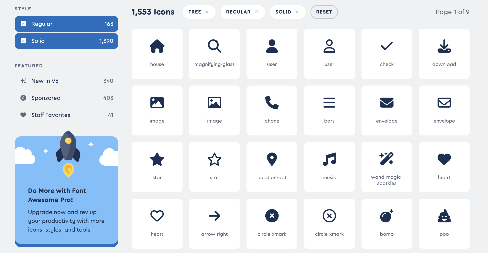
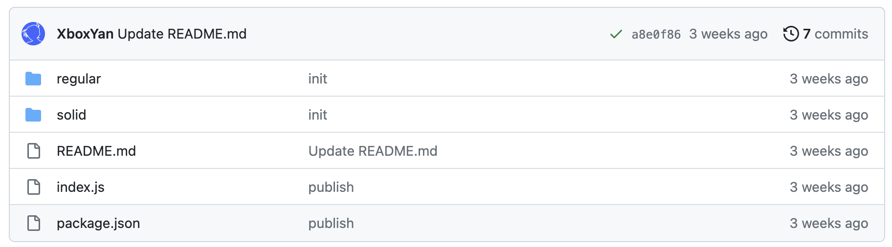

<script setup>
import { onMounted } from 'vue'
// import icon from '../../components/icon/'
// icon.urlPrefix = 'xx'
import './index.css'
  onMounted(() => {
    import('../../components/checkbox/')
    import('../../components/icon/')
  })
</script>

# icon

语义化的矢量图形。

图标来源：[https://fontawesome.com](https://fontawesome.com/v6/search?o=r&m=free&s=regular%2Csolid) 免费（1553个）图标



## 使用方式

```html
<!-- 引入 -->
<script type="module">
    import '../components/icon/index.js';
</script>
<!-- 使用 -->
<xy-icon name="user" size="30" color="orangered"></xy-icon>
```

## 静态资源路径`urlPrefix`

这是一个静态（`static`）属性，在`new`之前使用（`xy-icon`初始化之前），可以用来设置图标资源路径。

::: tip
组件本身不包含图标资源，所有图标都来源于一个静态资源 cdn 上
:::

默认地址为

```js
static urlPrefix = 'https://cdn.jsdelivr.net/gh/xboxyan/xy-ui-icons'
```

如果觉得这个 `cdn` 不稳定，可以将图标放到你自己的服务器上，在`import`后直接自定义

```js
import icon from '../components/icon/index.js';
icon.urlPrefix = '自定义静态资源地址'
```

## 名称`name`

图标名称与图标包名称相同，可参考[https://fontawesome.com](https://fontawesome.com/v6/search?o=r&m=free&s=regular%2Csolid)

<div class="wrap">
<xy-icon size="40" name="user"></xy-icon>
<xy-icon size="40" name="flag"></xy-icon>
<xy-icon size="40" name="image"></xy-icon>
<xy-icon size="40" name="star"></xy-icon>
<xy-icon size="40" name="face-smile"></xy-icon>
<xy-icon size="40" name="bell"></xy-icon>
</div>

```html
<xy-icon name="user"></xy-icon>
<xy-icon name="flag"></xy-icon>
<xy-icon name="image"></xy-icon>
<xy-icon name="star"></xy-icon>
<xy-icon name="face-smile"></xy-icon>
<xy-icon name="bell"></xy-icon>
```

JavaScript操作`set`

```js
icon.name = 'user';
//原生属性操作
icon.setAttribute('name','user');
```

## 类型`type`

图标有两种类型，`regular（常规、线性）`（默认）和`solid（填充）`

::: tip
并不是每种图标都对应两种风格，具体可以查看 [https://fontawesome.com](https://fontawesome.com/v6/search?o=r&m=free&s=regular%2Csolid)
:::

<div class="wrap">
<xy-icon name="flag" size="40"></xy-icon>
<xy-icon name="flag" type="solid" size="40"></xy-icon>
<xy-icon name="clock" size="40"></xy-icon>
<xy-icon name="clock" type="solid" size="40"></xy-icon>
<xy-icon name="star" size="40"></xy-icon>
<xy-icon name="star" type="solid" size="40"></xy-icon>
</div>

```html
<xy-icon name="flag"></xy-icon>
<xy-icon name="flag" type="solid"></xy-icon>
<xy-icon name="clock"></xy-icon>
<xy-icon name="clock" type="solid"></xy-icon>
<xy-icon name="star"></xy-icon>
<xy-icon name="star" type="solid"></xy-icon>
```

JavaScript操作`set`

```js
icon.type = 'solid';
//原生属性操作
icon.setAttribute('type','solid');
```

两个属性太麻烦了，现提供一种简洁写法，可以将`name`和`type`用一个属性`name`表示，格式形如`type/name`

<div class="wrap">
<xy-icon name="flag" size="40"></xy-icon>
<xy-icon name="flag" type="solid" size="40"></xy-icon>
<xy-icon name="clock" size="40"></xy-icon>
<xy-icon name="clock" type="solid" size="40"></xy-icon>
<xy-icon name="star" size="40"></xy-icon>
<xy-icon name="star" type="solid" size="40"></xy-icon>
</div>

```html
<xy-icon name="flag"></xy-icon>
<xy-icon name="solid/flag"></xy-icon>
<xy-icon name="clock"></xy-icon>
<xy-icon name="solid/clock"></xy-icon>
<xy-icon name="star"></xy-icon>
<xy-icon name="solid/star"></xy-icon>
```

如果使用自己的`cdn`图标资源，需要注意文件夹目录（文件夹对应为`type`，文件名对应为`name`），默认为

```
── regular
    ├── a.svg
    └── b.svg
── solid
    ├── a.svg
    └── b.svg
```

参考 https://github.com/XboxYan/xy-ui-icons



## 尺寸`size`

通过`size`可以设置图标尺寸，默认为`font-size`大小。

<div class="wrap">
<xy-icon name="flag" size="20"></xy-icon>
<xy-icon name="flag" size="30"></xy-icon>
<xy-icon name="flag" size="40"></xy-icon>
<xy-icon name="flag" size="50"></xy-icon>
</div>

```html
<xy-icon name="flag" size="20"></xy-icon>
<xy-icon name="flag" size="30"></xy-icon>
<xy-icon name="flag" size="40"></xy-icon>
<xy-icon name="flag" size="50"></xy-icon>
```

CSS操作（推荐）

```css
xy-icon{
    font-size:30;
}
```

JavaScript操作`get`、`set`

```js
icon.size;
icon.size = 30;
//原生属性操作
icon.getAttribute('size');
icon.setAttribute('size',30);
```

::: tip
CSS操作更灵活，可以写在样式中，属性值和JavaScript操作优先级更高，下同
:::

## 颜色`color`

通过`color`可以设置图标颜色，默认为`color`文字颜色。

<div class="wrap">
<xy-icon size="40" name="flag" color="orangered"></xy-icon>
<xy-icon size="40" name="flag" color="#1E90FF"></xy-icon>
<xy-icon size="40" name="flag" color="#F44336"></xy-icon>
<xy-icon size="40" name="flag" color="#3F51B5"></xy-icon>
</div>

```html
<xy-icon name="flag" color="orangered"></xy-icon>
<xy-icon name="flag" color="#1E90FF"></xy-icon>
<xy-icon name="flag" color="#F44336"></xy-icon>
<xy-icon name="flag" color="#3F51B5"></xy-icon>
```

CSS操作（推荐）

```css
xy-icon{
    color: orangered;
}
```

JavaScript操作`get`、`set`

```js
icon.color;
icon.color = 'orangered';
//原生属性操作
icon.getAttribute('color');
icon.setAttribute('color','orangered');
```

## 自定义样式`::part(icon)`
如果自带的图标仍不满足需求，可以自定义样式，需要深入到`shadow dom`中，这里暴露了内置伪元素`::part(icon)`用来自定义样式

 内部结构如下（可查看控制台）：

```html
<xy-icon>
  # shadow-root
    <i part="icon">
```

内部是通过遮罩实现，需要修改`-webkit-mask-image`，比如

<style scoped>
.custom{
  --icon: url("data:image/svg+xml,%3Csvg xmlns='http://www.w3.org/2000/svg' viewBox='0 0 512 512'%3E %3Cpath d='M473.7 73.8l-2.4-2.5c-46-47-118-51.7-169.6-14.8L336 159.9l-96 64 48 128-144-144 96-64-28.6-86.5C159.7 19.6 87 24 40.7 71.4l-2.4 2.4C-10.4 123.6-12.5 202.9 31 256l212.1 218.6c7.1 7.3 18.6 7.3 25.7 0L481 255.9c43.5-53 41.4-132.3-7.3-182.1z'%3E%3C/path%3E %3C/svg%3E")
}
</style>

<div class="wrap">
<xy-icon size="40" class="custom"></xy-icon>
</div>

```css
xy-icon::part(rate){
  -webkit-mask-image: url("data:image/svg+xml,%3Csvg xmlns='http://www.w3.org/2000/svg' viewBox='0 0 512 512'%3E %3Cpath d='M473.7 73.8l-2.4-2.5c-46-47-118-51.7-169.6-14.8L336 159.9l-96 64 48 128-144-144 96-64-28.6-86.5C159.7 19.6 87 24 40.7 71.4l-2.4 2.4C-10.4 123.6-12.5 202.9 31 256l212.1 218.6c7.1 7.3 18.6 7.3 25.7 0L481 255.9c43.5-53 41.4-132.3-7.3-182.1z'%3E%3C/path%3E %3C/svg%3E")
}
```

或者，直接通过 CSS 变量 `--icon` 传递，可以无需`::part(icon)`，比如

```css
xy-icon{
  --icon: url("data:image/svg+xml,%3Csvg xmlns='http://www.w3.org/2000/svg' viewBox='0 0 512 512'%3E %3Cpath d='M473.7 73.8l-2.4-2.5c-46-47-118-51.7-169.6-14.8L336 159.9l-96 64 48 128-144-144 96-64-28.6-86.5C159.7 19.6 87 24 40.7 71.4l-2.4 2.4C-10.4 123.6-12.5 202.9 31 256l212.1 218.6c7.1 7.3 18.6 7.3 25.7 0L481 255.9c43.5-53 41.4-132.3-7.3-182.1z'%3E%3C/path%3E %3C/svg%3E")
}
```

> 图标来源于 https://www.zhangxinxu.com/sp/icon/

还可以设置渐变色，需要通过`::part(icon)`覆盖

<style scoped>
.custom2::part(icon){
  background: linear-gradient( #FF5722, #FF9800)
}
</style>

<div class="wrap">
<xy-icon size="40" name="solid/flag" class="custom2"></xy-icon>
<xy-icon size="40" name="solid/heart" class="custom2"></xy-icon>
<xy-icon size="40" name="solid/star" class="custom2"></xy-icon>
</div>

```css
xy-icon::part(icon){
  background: linear-gradient( #FF5722, #FF9800)
}
```

## 旋转`spin`

添加`spin`属性可以让图标旋转起来，实现`loading`的效果

<div class="wrap">
<xy-icon size="40" name="spinner" type="solid" spin></xy-icon>
<xy-icon size="40" name="rotate" type="solid" spin></xy-icon>
<xy-icon size="40" name="yin-yang" type="solid" spin></xy-icon>
<xy-icon size="40" name="arrow-rotate-right" type="solid" spin></xy-icon>
</div>

```html
<xy-icon name="spinner" type="solid" spin></xy-icon>
<xy-icon name="rotate" type="solid" spin></xy-icon>
<xy-icon name="yin-yang" type="solid" spin></xy-icon>
<xy-icon name="arrow-rotate-right" type="solid" spin></xy-icon>
```

> 其实就是一个`css`动画

JavaScript操作`get`、`set`

```js
icon.spin;
icon.spin = false;
icon.spin = true;
//原生属性操作
icon.getAttribute('spin');
icon.setAttribute('spin','');
icon.removeAttribute('spin');
icon.toggleAttribute('spin', [force]);
```

可以简单实现一个自定义 `loading`

<div class="wrap">
<xy-icon name="spinner" type="solid" spin style="color: var(--primary-color)"></xy-icon>
<xy-checkbox checked onchange="this.previousElementSibling.spin = this.checked;">加载</xy-checkbox>
</div>