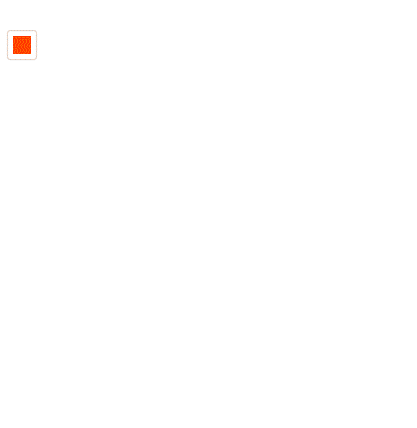

# update
* ## 1.4.0
    * 新增`xy-color-picker`颜色选择器、`xy-color-pane`颜色面板

    

    * 优化[xy-popover](xy-popover.md)空白处点击处关闭逻辑
    * 修复[xy-select](xy-select.md)`hover`层级问题
* ## 1.3.4
    * [xy-button](xy-button.md?id=状态切换toggle)新增`toggle`属性
    * 修复[xy-select](xy-select.md)样式问题
    * 修复[xy-switch](xy-switch.md)、[xy-checkbox](xy-checkbox.md)点击重复触发`focus`的问题
    * 修复[xy-radio](xy-radio.md)在自定义组件内单选问题
* ## 1.3.3
    * 重构[xy-select](xy-select.md)，基于`xy-popover`，逻辑更清晰
    * 修复[xy-popover](xy-popover.md)、[xy-select](xy-select.md)空白处点击处关闭的问题
* ## 1.3.2
    * 修复[xy-popover](xy-popover.md?id=触发trigger)在火狐上的触发（`hover`、`focus`）问题
    * 新增[xy-popover](xy-popover.md?id=示例)示例
* ## 1.3.1
    * [xy-popover](xy-popover.md?id=触发trigger)新增`trigger`属性
* ## 1.3.0
    * 新增[xy-popover](xy-popover.md)悬浮操作组件
    * [xy-tips](xy-tips.md?id=方向dir)的`dir`新增`8`个方向
    * [xy-button](xy-button.md?id=链接href)新增`href`属性
    * [xy-input](xy-input.md?id=oninput)新增`debounce`属性
    * 优化[xy-select](xy-select.md)逻辑
* ## 1.2.0
    * 修复`xy-img`关闭画廊时的定位问题
    * 精简所有`focus`、`blur`事件
    * 新增[xy-rate](xy-rate.md)组件
* ## 1.1.0
    * 重构`xy-button`组件结构，更易于自定义
    * 新增[xy-img](xy-img.md)组件
* ## 1.0.2
    * 修复已知bug
    * `xy-slider` 新增`suffix`属性
* ## 1.0.0
    * 完成基本组件
    - [x] [xy-button](xy-button.md)
    - [x] [xy-icon](xy-icon.md)
    - [x] [xy-slider](xy-slider.md)
    - [x] [xy-select](xy-select.md)
    - [x] [xy-loading](xy-loading.md)
    - [x] [xy-tab](xy-tab.md)
    - [x] [xy-switch](xy-switch.md)
    - [x] [xy-checkbox](xy-checkbox.md)
    - [x] [xy-radio](xy-radio.md)
    - [x] [xy-tips](xy-tips.md)
    - [x] [xy-layout](xy-layout.md)
    - [x] [xy-dialog](xy-dialog.md)
    - [x] [xy-input](xy-input.md)
    - [x] [xy-textarea](xy-textarea.md)