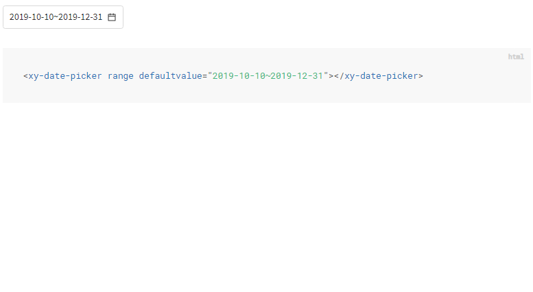
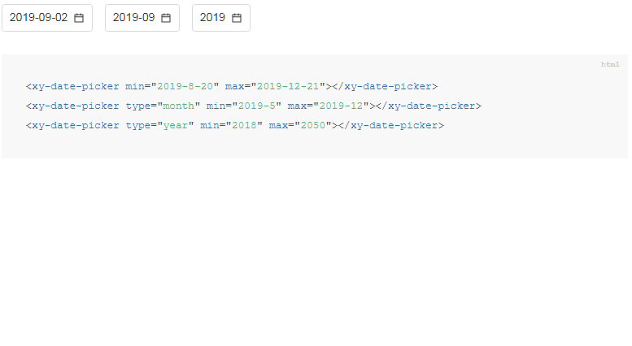
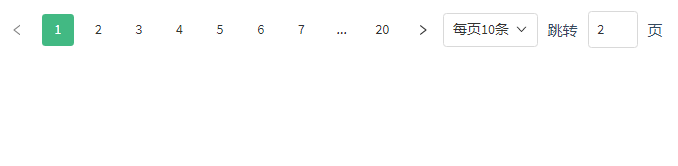
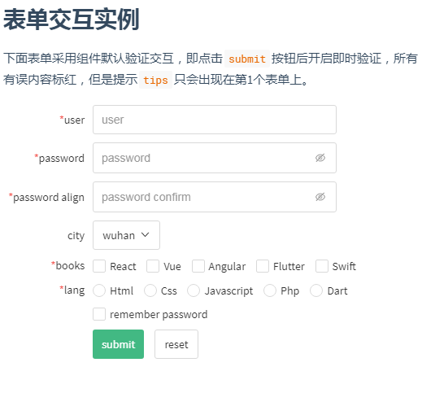
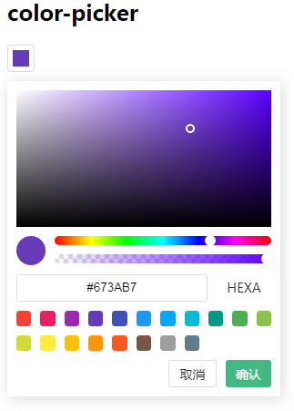

# update
* ## 1.10.1
    * disconnectedCallback移除document事件监听
* ## 1.10.0
    * 新增[`xy-datalist`](xy-datalist.md)数据列表组件
    * 重新独立`xy-option`
    * `xy-checkbox`、`xy-raido`键盘触发事件优化
* ## 1.9.6
    * `xy-tab`现支持方向键切换
    * `xy-pagination`支持链接访问
    * 修复`xy-input`、`xy-dialog`视觉性问题
* ## 1.9.5
    * 修复`xy-popover`关于`title`属性失效的问题
    * 重新整理`xy-tips`关于[`dir`](xy-tips.md?id=方向dir)方向的展示，更直观
    * 优化`确定`、`取消`按钮的大小，并增加了空格，更和谐
* ## 1.9.4
    * 移除`Edge`密码输入框的默认切换按钮
* ## 1.9.3
    * 新增[`xy-input-group`](xy-input.md?id=组合xy-input-group)组件
    * `xy-icon`新增`spin`属性
    * 修复`input[type=number]`的`onchange`回调
    * 修复`xy-color-picker`色相选择回调
* ## 1.9.2
    * `xy-view`新增`coord`坐标
    * 所有表单元素只有在实际触发（比如点击、键盘`Enter`）时才会触发`change`回调，通过直接修改`value`不会触发（与原生保持一致）
* ## 1.9.1
    * [`xy-view`](xy-view.md)新增`draggable`、`allowdrop`、`resizable`等特性
    * 新增[`xy-button-group`](xy-button-group.md?id=按钮组xy-button-group)组件
* ## 1.9.0
    * `xy-form-item`布局采用`grid`实现，去除`legendwidth`属性
    * `xy-text`新增`draggable`属性
    * 表单元素的`reset`方法现定义为"重置"，即还原成默认值
    * `xy-select`新增分组`xy-optgroup`
    * 新增`xy-view`组件（实验性），扩展常见功能，如`drag`等（进行中）
* ## 1.8.8
    *  所有表单元素在表单校验失败时会添加`invalid`属性
    * `xy-tab`在切换时会自适应高度
* ## 1.8.7
    * `xy-slider`新增鼠标滚轮操作
    * `xy-select`新增`placeholder`,`required`属性，支持表单验证
    * `xy-select`搜索条件改为根据`key`查找
    * `xy-popover`现支持点击内部属性带有`autoclose`的元素自动关闭
    * `xy-input`在表单校验失败是会添加`invalid`属性
    * 其他功能优化
* ## 1.8.6
    * [`xy-select`](xy-select.md?id=搜索search)新增`search`属性
    * `xy-input`新增`readonly`属性
    * `xy-tab`新增`line`风格
* ## 1.8.5
    * `xy-tab`新增`card`风格
    * `xy-dialog`新增`prompt`方法
    * `xy-select`现在在不打开的情况下也可以用键盘上下键快速选中
    * `xy-slider`更改`vertical`属性下的`tips`方向
    * `xy-text`在出现省略时会添加`truncated`属性标识
    * 修复`xy-select`、`xy-color-picker`、`xy-date-picker`在`disabled`状态下打开的问题
* ## 1.8.4
    * `xy-slider`在`vertical`属性下支持动态样式修改
* ## 1.8.3
    * `xy-slider`新增`vertical`、`prefix`属性
* ## 1.8.2
    * [`xy-layout`](xy-layout.md?id=栅格row、col)新增`grid`栅格布局
    * `xy-button`新增`danger`类型
    * 修复`xy-slider`在火狐上的`input`触发问题
    * 其他`bug`修复
* ## 1.8.1
    * 新增[`xy-text`](xy-text.md)组件
* ## 1.8.0
    * 新增[`xy-table`](xy-table.md)组件
    * `xy-checkbox`新增`indeterminate`状态
    * 修复`xy-date-picker`在`1`月份选取去年`12`月份的`bug`
    * 修复`xy-color-pane`在空白处触发`change`的`bug`
* ## 1.7.1
    * [`xy-date-picker`](xy-date-picke.md)新增[`range`](xy-date-picke.md?id=范围选择range)属性

    

    * 优化`xy-color-picker`和`xy-date-picker`初始化逻辑
    * 其他`bug`修复
* ## 1.7.0
    * 新增[`xy-date-picker`](xy-date-picke.md)组件

    

    * 优化`xy-icon`的图标加载方式，不会再阻塞页面渲染了~
    * 主题配置新增`--themeBackground`
    * 其他`bug`修复
* ## 1.6.1
    * 优化`xy-button`的`Enter`键逻辑
    * 优化`xy-icon`的图标加载方式
    * 替换部分组件内置图标为`svg`方式，减少`xy-icon`依赖
* ## 1.6.0
    * 新增[`xy-pagination`](xy-pagination.md)分页组件

    

    * 修复`xy-form`下`xy-select`回车键触发`submit`问题
    * 更改组件尺寸为`em`相对尺寸，部分组件除外
    * `xy-color-pane`现在在鼠标抬起时才触发`change`回调
    * 其他`bug`修复
* ## 1.5.2
    * 修改属性`lable`为`legend`，`lablewidth`为`legendwidth`
    * `xy-radio-group`、`xy-checkbox-group`新增`disabled`属性
    * 优化`xy-form`和`xy-form-item`的`lablewidth`属性
    * `xy-popover`优化关闭按钮样式
    * `xy-color-picker`新增内置颜色
    * `xy-form`表单校验不会对`disabled`属性表单元素进行校验
* ## 1.5.1
    * 优化`xy-radio-group`和`xy-checkbox-group`的`hover`层级问题
    * `xy-form`新增演示动画

    
    
* ## 1.5.0
    * 新增[`xy-form`](xy-form.md)表单组件，集成表单验证功能
    * 新增`xy-radio-group`和`xy-checkbox-group`组件
    * `xy-img`新增加载动画
    * 主题颜色管理，`fontColor`、`errorColor`、`successColor`、`warningColor`、`borderColor`等
    * 其他`bug`修复
* ## 1.4.2
    * 重构[`xy-icon`](xy-icon.md)的引用方式，不用再设置`iconUrl`和`basePath`了~
    * 支持`cdn`引入，采用[unpkg](https://unpkg.com/)
    * 新增`react`项目使用方式[demo](https://codepen.io/xboxyan/pen/mNKWaN)
* ## 1.4.0
    * 新增`xy-color-picker`颜色选择器、`xy-color-pane`颜色面板

    

    * 优化[xy-popover](xy-popover.md)空白处点击处关闭逻辑
    * 修复[xy-select](xy-select.md)`hover`层级问题
* ## 1.3.4
    * [xy-button](xy-button.md?id=状态切换toggle)新增`toggle`属性
    * 修复[xy-select](xy-select.md)样式问题
    * 修复[xy-switch](xy-switch.md)、[xy-checkbox](xy-checkbox.md)点击重复触发`focus`的问题
    * 修复[xy-radio](xy-radio.md)在自定义组件内单选问题
* ## 1.3.3
    * 重构[xy-select](xy-select.md)，基于`xy-popover`，逻辑更清晰
    * 修复[xy-popover](xy-popover.md)、[xy-select](xy-select.md)空白处点击处关闭的问题
* ## 1.3.2
    * 修复[xy-popover](xy-popover.md?id=触发trigger)在火狐上的触发（`hover`、`focus`）问题
    * 新增[xy-popover](xy-popover.md?id=示例)示例
* ## 1.3.1
    * [xy-popover](xy-popover.md?id=触发trigger)新增`trigger`属性
* ## 1.3.0
    * 新增[xy-popover](xy-popover.md)悬浮操作组件
    * [xy-tips](xy-tips.md?id=方向dir)的`dir`新增`8`个方向
    * [xy-button](xy-button.md?id=链接href)新增`href`属性
    * [xy-input](xy-input.md?id=oninput)新增`debounce`属性
    * 优化[xy-select](xy-select.md)逻辑
* ## 1.2.0
    * 修复`xy-img`关闭画廊时的定位问题
    * 精简所有`focus`、`blur`事件
    * 新增[xy-rate](xy-rate.md)组件
* ## 1.1.0
    * 重构`xy-button`组件结构，更易于自定义
    * 新增[xy-img](xy-img.md)组件
* ## 1.0.2
    * 修复已知bug
    * `xy-slider` 新增`suffix`属性
* ## 1.0.0
    * 完成基本组件
    - [x] [xy-button](xy-button.md)
    - [x] [xy-icon](xy-icon.md)
    - [x] [xy-slider](xy-slider.md)
    - [x] [xy-select](xy-select.md)
    - [x] [xy-loading](xy-loading.md)
    - [x] [xy-tab](xy-tab.md)
    - [x] [xy-switch](xy-switch.md)
    - [x] [xy-checkbox](xy-checkbox.md)
    - [x] [xy-radio](xy-radio.md)
    - [x] [xy-tips](xy-tips.md)
    - [x] [xy-layout](xy-layout.md)
    - [x] [xy-dialog](xy-dialog.md)
    - [x] [xy-input](xy-input.md)
    - [x] [xy-textarea](xy-textarea.md)
